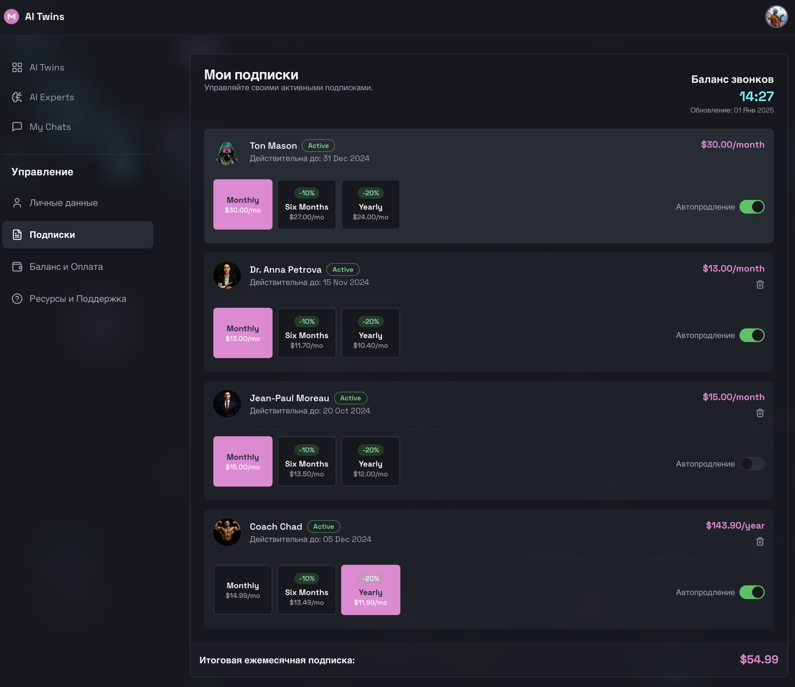

# Управление Подписками

## 1. Страница Подписок (My Subscriptions)
Здесь пользователь видит свои подписки и доступные тарифы.

### Блок: Список Ботов и Тарифов
* **API Метод**: `BillingService/GetSubscriptionDashboard`
* **Модель**: `SubscriptionDashboardData` -> `subscriptions` (List Subscription).
* **Логика Отображения**:
    1.  **Группировка**: Список ботов, на которых пользователь подписан.
    2.  **Активный Тариф (Current Plan)**:
        *   Выделяется среди списка доступных.
        *   **Legacy/Exclusive**: Если тариф `ARCHIVED` (больше не продается), он все равно отображается с пометкой "Архивный / Эксклюзив".
    3.  **Детали Тарифа**:
        *   **Цена**: `price` + `currency` ("10 USD").
        *   **Периодичность**: `paymentType` (Например, "в месяц").
        *   **Длительность**: `durationMonths` ("на протяжении года").
        *   **Даты**: `startsAt` - `expiresAt`.
        *   **Автопродление**: Тоггл `autoRenew` (Вкл/Выкл).
    4.  **Статус**:
        *   `ACTIVE`: Зеленый.
        *   `SUSPENDED`: Красный ("Приостановлено: Ошибка оплаты").
        *   `EXPIRED`: Серый ("Истекла").

### Действия (Actions)
1.  **Смена Тарифа (Change Plan)**:
    *   Пользователь выбирает другой тариф из списка (Upgrade/Downgrade).
    *   **UI**: Модальное окно подтверждения ("Вы уверены?").
    *   **Метод**: `BillingService/ChangeSubscription(subscriptionId, newPlanId)`.
    *   **Логика**:
        *   *Upgrade*: Мгновенный перерасчет.
        *   *Downgrade*: Смена произойдет в конце текущего периода.
2.  **Автопродление (Auto-Renew)**:
    *   Тоггл. Метод `BillingService/ToggleAutoRenew(subscriptionId, bool)`.
