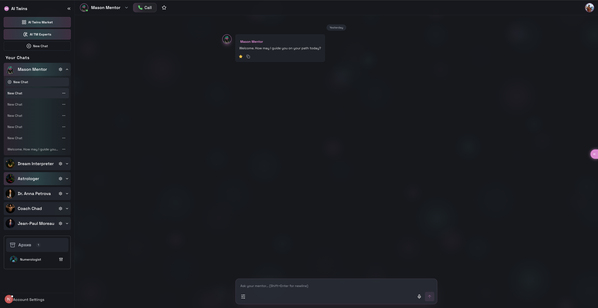
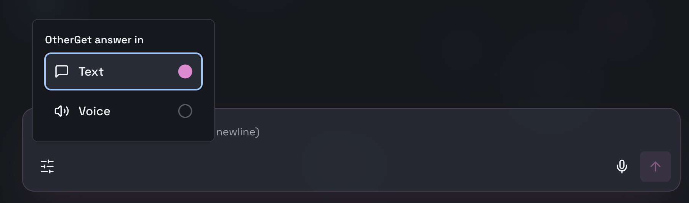
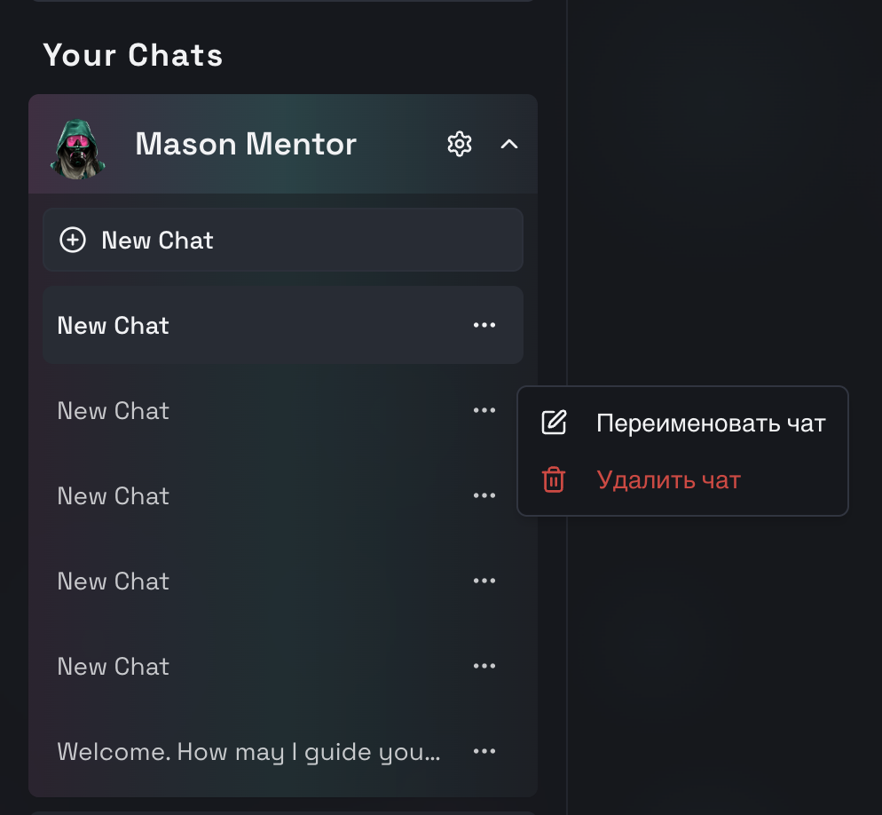

# Библиотека и Чат (Library & Active Chat)

## 1. Интерфейс Чата (Split View)
Страница активного диалога с ботом, разделенная на список (Sidebar) и сам чат.

### Блок: Sidebar (Список Ботов и Диалогов)
* **API Метод**: `ChatService/GetBotList(pagination)`.
* **Модель**: `ChatThread` (Краткая информация).
* **Логика Отображения**:
    1.  **Pinning (Закрепление)**:
        *   **Иконка**: Скрепка (📌).
        *   **Действие**: `ChatService/PinChat(threadId)` / `UnpinChat`.
        *   **Сортировка (Drag & Drop)**: Пользователь может менять порядок закрепленных чатов перетаскиванием (`ChatService/ReorderPinnedChats`).
    2.  **Группировка**:
        *   **Pinned Chats**: Всегда сверху.
        *   **Recent Chats**: Остальные диалоги в хронологическом порядке (`lastMessageAt`).
    3.  **Индикаторы**:
        *   `Unread Count` (если есть).
        *   `Status`: Typing... (через Stream).

### Блок: Окно Чата (Messages Area)
* **API Метод**: `ChatService/GetHistory(threadId, filter=ALL|FAVORITES)`.
* **Модель**: `Message`.
* **Функционал**:
    1.  **Избранные Сообщения (Favorites)**:
        *   **Действие**: Клик на `Star` (⭐) у сообщения -> `ChatService/ToggleMessageFavorite`.
        *   **Поиск/Фильтр**: Кнопка "Show only Favorites" в хедере чата -> перезагружает историю с `filter=FAVORITES`.
        *   **Отображение**: Только "звездные" сообщения (цитатник).
    2.  **Контент**:
        *   Текст, Аудио (плеер + транскрипция), Картинки.
        *   **Sinking Mode**: Анимация "Thinking..." перед ответом.

### Блок: Input (Ввод)
* **Modes**: Text / Voice (Hold-to-Record).
### Блок: Режим Ответа (Response Mode Widget)

* **Локация**: Рядом с полем ввода (слева/справа) или в хедере.
* **API Метод**: `UpdateChatSettings({ responseMode: "VOICE" })`.
* **Функциональность**:
    *   **Переключатель (Toggle/Select)**:
        *   **Text (Текст)**: Бот отвечает текстовым сообщением.
        *   **Voice (Голос)**: Бот отвечает голосовым сообщением (аудио + текст).
    *   **Индикация**:
        *   Иконка (📝 vs 🎙️).
        *   Плавная анимация переключения.
    *   **Влияние**: Не меняет способ ввода юзера (вы можете говорить голосом, а бот отвечать текстом), меняет только *формат ответа*.

### Блок: Контекстное Меню Чата (Chat Actions)

* **Локация**: Кнопка **"три точки" (...)** или **"шестеренка"** в заголовке открытого чата.
* **API Метод**: Методы сервиса `ChatService`.
* **Функциональность**:
    1.  **Переименовать (Rename)**:
        *   **Действие**: Открывает модальное окно с полем ввода.
        *   **API**: `UpdateChatThread({ title: "My New Title" })`.
        *   **UX**: Название чата мгновенно обновляется в сайдбаре.
        *   *По умолчанию*: Чат называется по первому сообщению (Auto-generated), но юзер может переопределить.
    2.  **Архвировать (Archive)**:
        *   **Действие**: Убирает чат из списка активных.
        *   **API**: `ArchiveChat(threadId)`.
    3.  **Удалить (Delete)**:
        *   **Действие**: Удаляет историю переписки навсегда.
        *   **UI**: **Красная кнопка** + Confirm Modal ("Вы уверены?").
        *   **API**: `DeleteChatThread(threadId)`.
