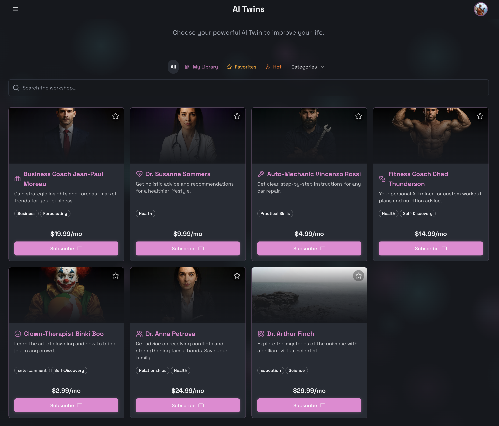
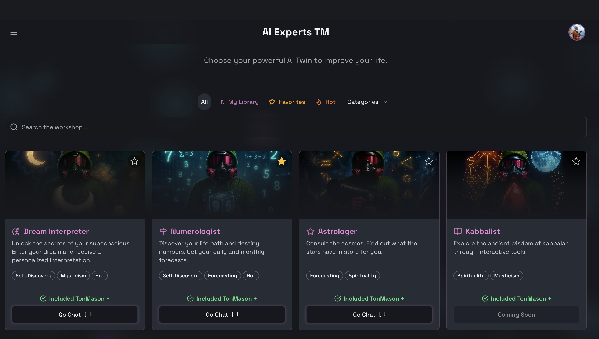

# Маркетплейс и Каталог (Marketplace)

## 1. Список Ботов - Двойники (Twins Tab)
Страница каталога с включенным фильтром по типу "Двойники" и активными фильтрами по категориям/свойствам.

## 2. Список Ботов - Эксперты (Experts Tab)
Страница каталога с включенным фильтром по типу "Эксперты".

### Блок: Фильтры (Аналогично Twins)
* **API Метод**: `BotService/ListBots({ genre: "EXPERT", ... })`.
* **Визуальные отличия**:
    *   Карточки могут иметь специальные бейджи "Official" или "TonMason Certified".
    *   Возможно, другая цветовая схема или выделение (Accent Color).

### Блок: Фильтры (Sidebar / Top Bar)
* **API Метод**: `BotService/ListBots({ genre: "TWIN", ... })`.
* **Логика Фильтрации**:
    1.  **Категории (Category)**:
        *   Список жанров/тегов (например, "Бизнес", "IT", "Коучинг").
        *   Множественный выбор (Checkbox) или Одиночный (Radio).
    2.  **Свойства (Flags)**:
        *   **Favorites Only**: Показать только избранных (`isFavorite=true`).
        *   **HOT / Top Rated**:
            *   Фильтр "Трендовые" (`isHot=true`).
            *   *Альтернатива*: Фильтр "Высокий рейтинг" (`minRating=4.5` или сортировка по рейтингу).
            *   Отображаются боты с наибольшим количеством звезд/подписчиков.

### Блок: Сетка Ботов (Bots Grid)
* **Модель**: `Bot` (Краткая информация).
* **Элементы Карточки**:
    *   **Аватар и Имя**.
    *   **Описание**: `shortDescription` (обрезается).
    *   **Бейджи**: `HOT`, `EXPERT` (если применимо).
    *   **Рейтинг**: Звезды (например, "★ 4.8 (120)").
    *   **Цена**: "от 10 TON".
    *   **Действия**:
        *   Клик -> Переход на страницу [Карточка Бота](./bot_details.md).
        *   Like/Star -> Добавить в избранное (`ToggleBotFavorite`).
