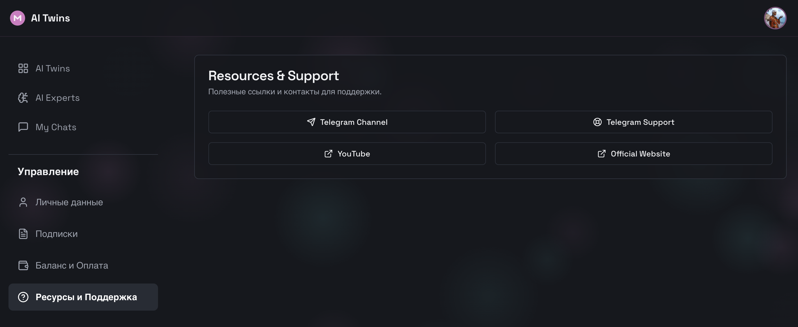

# Ресурсы и Поддержка (Static Info)

## 1. Страница Поддержки (Support Page)
Статический экран с контактами компании и важными ссылками.

### Блок: Контакты (Contacts)
* **Тип контента**: Hardcoded (Фронтенд).
* **Модель**: Отсутствует (JSON-конфиг фронтенда).
* **Данные**:
    *   **Email**: `support@tonmason.com` (ссылка `mailto:`).
    *   **Telegram**: `@MentorSupportBot` (ссылка `tg://`).
    *   **Website**: `tonmason.com`.

### Блок: Ресурсы (Resources / FAQ)
* **Ссылки**:
    *   **User Guide**: Гайд по использованию платформы.
    *   **Terms of Service**: Правила использования.
    *   **Privacy Policy**: Политика конфиденциальности.
* **Версия**: Отображение текущей версии приложения (v1.0.2).

### Логика
* Страница полностью автономна, загружается быстро, работает оффлайн (PWA).
