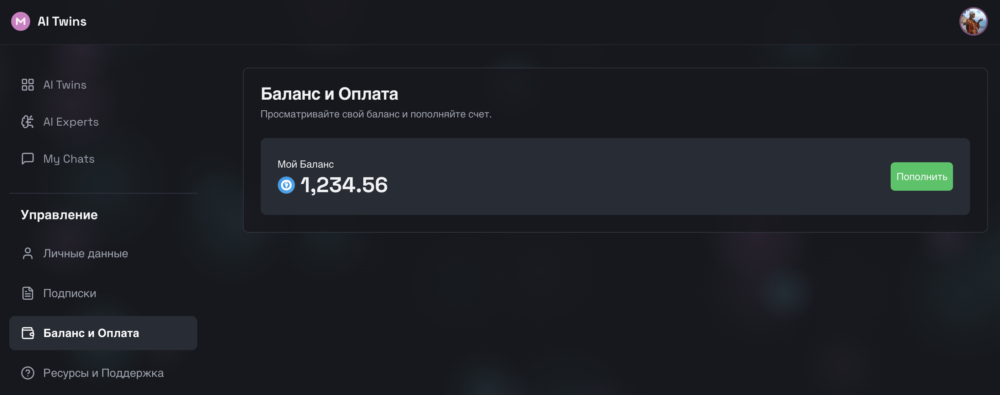

# Кошелек и История Транзакций

## 1. Страница Баланса (Balance & History)
Пользователь управляет своими финансами: просмотр остатка, история покупок, пополнение.

### Блок: Текущий Баланс (Current Balance)
* **API Метод**: `IdentityService/GetMyProfile` -> поле `balances`.
* **Модель**: `BalanceItem` (Currency ID + Value String).
* **Отображение**:
    *   **Value**: Крупное число (например, "125.50").
    *   **Currency**: Иконка/Символ валюты (TON, USDT).
    *   **Deposit**: Кнопка "Пополнить" (`depositUrl`).

### Блок: История Транзакций (Transaction History)
* **API Метод**: `BillingService/GetTransactionHistory(pagination)`.
* **Модель**: `Transaction` (Invoice History).
* **Таблица**:
    *   **Date**: Дата и время операции (`createdAt`).
    *   **Description**: Название услуги ("Subscription: Elon Musk Twin - PRO").
    *   **Amount**: Сумма списания ("-10.00 TON").
    *   **Status**:
        *   `SUCCESS`: Зеленая галочка (Успешно).
        *   `PENDING`: Часики (В обработке).
        *   `FAILED`: Красный крестик (Ошибка - недостаточно средств).
    *   **Invoice ID**: Ссылка на чек (опционально).

### Сценарии
1.  **Пополнение**: При нажатии "Deposit" открывается WebView или ссылка на крипто-шлюз.
2.  **Детали списания**: При клике на строке истории открывается детализация (что именно было куплено, период действия).
